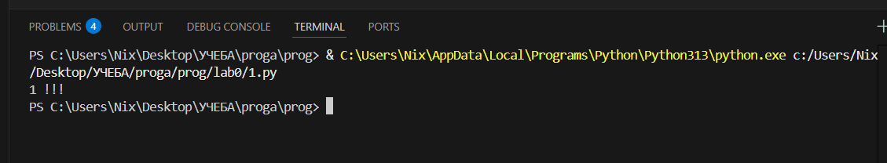

# Отчёт по лабораторной работе №0

## Задание

Написать программу, запустить её, сделать коммит и пуш, написать отчёт.

## Описание проделанной работы

На платформе GitHub был создан новый репозиторий.\
 Репозиторий был склонирован на локальный компьютер с помощью команды ... .\
 После выполнения команды репозиторий появился в текущей директории.\
 В локальной копии репозитория был создан файл 1.py с первой программой.

Содержимое файла:

>b = 2\
>c = 1\
>a = b - c\
>print(a, "!!!")

После успешного запуска программы изменения были зафиксированы и отправлены в репозиторий на GitHub.
