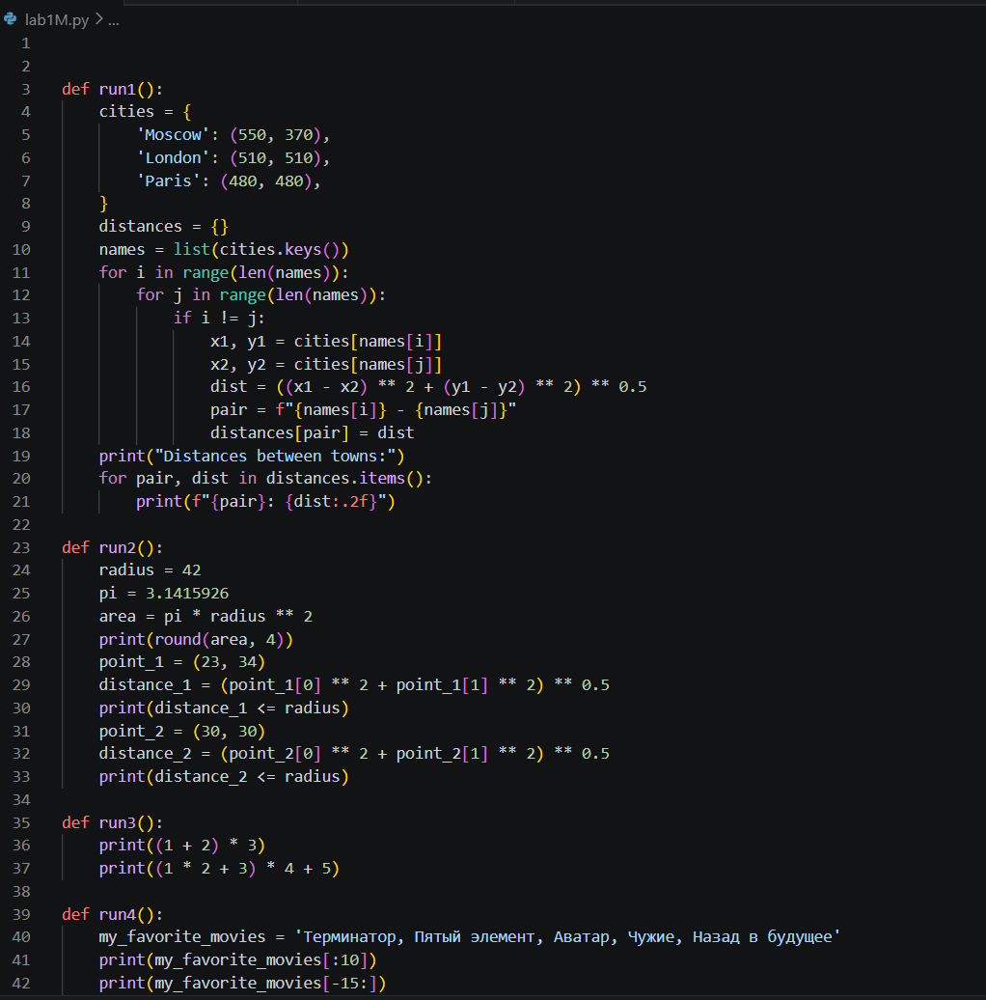
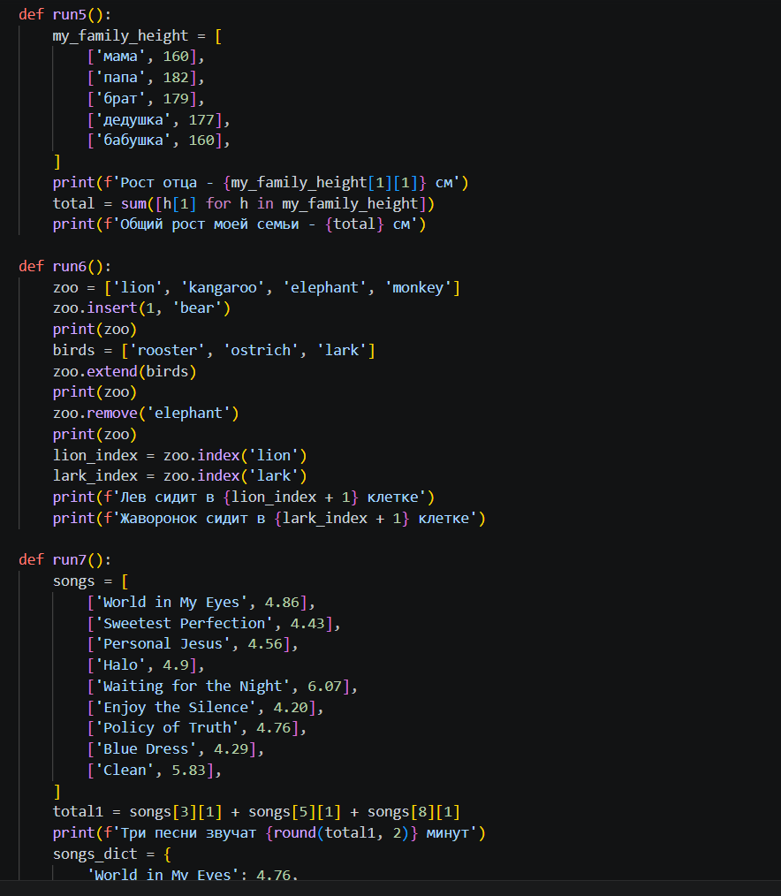
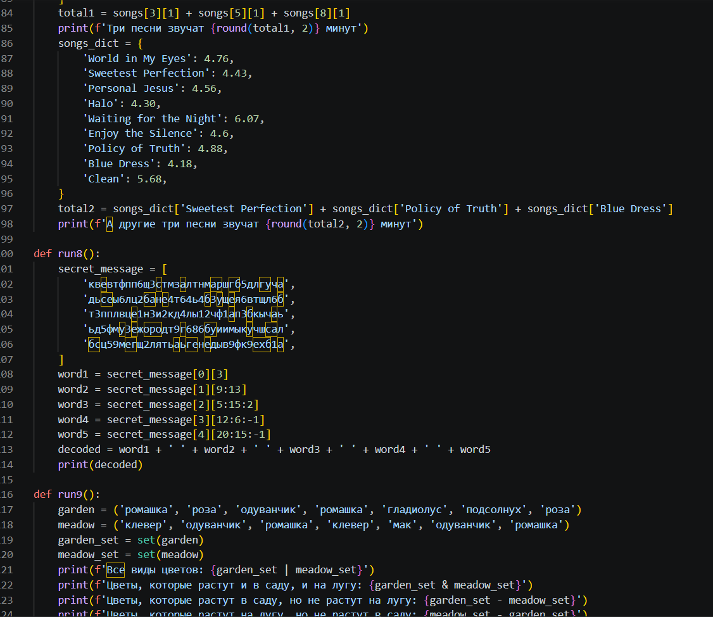
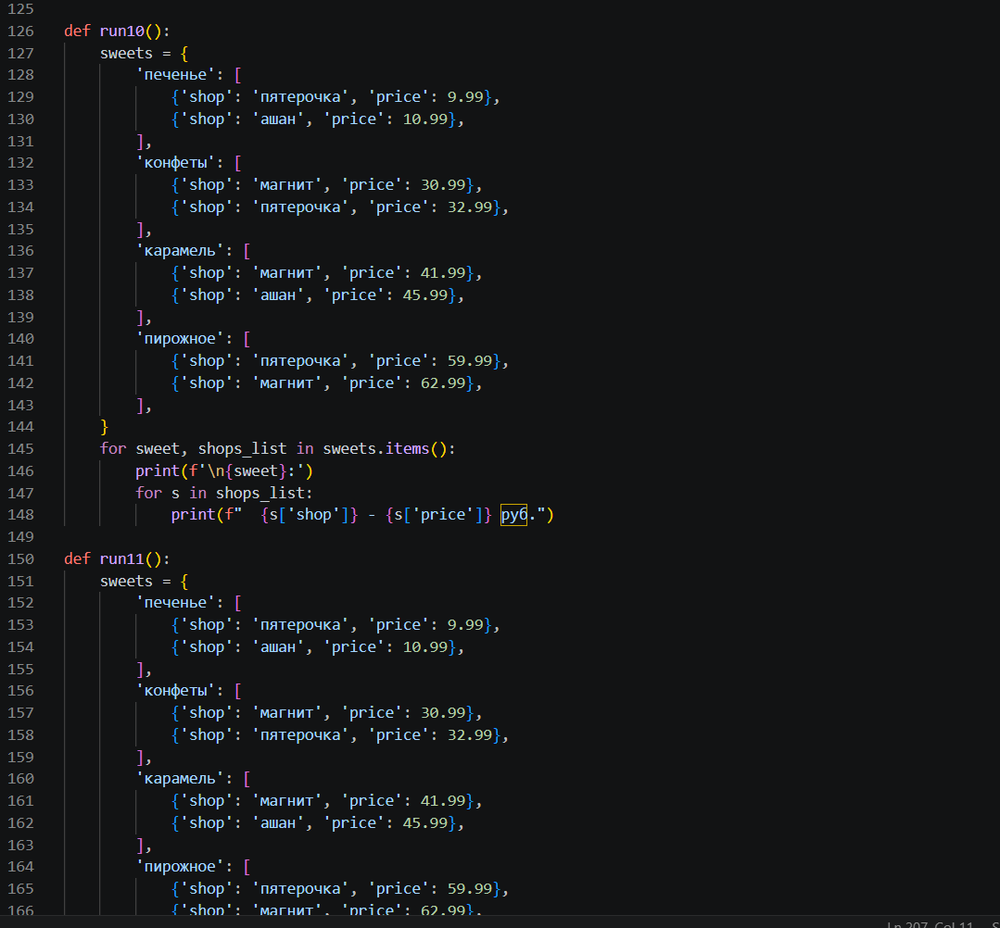
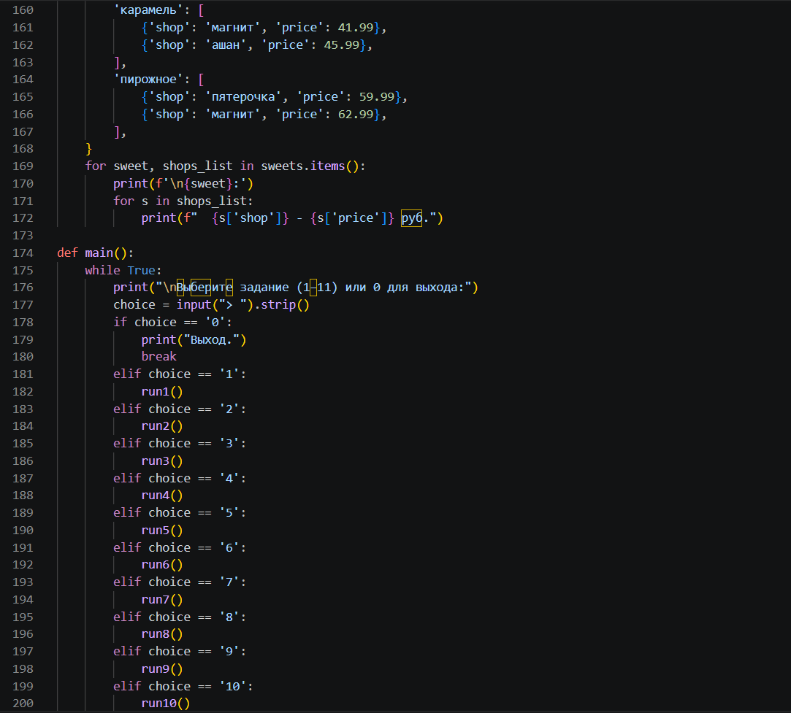
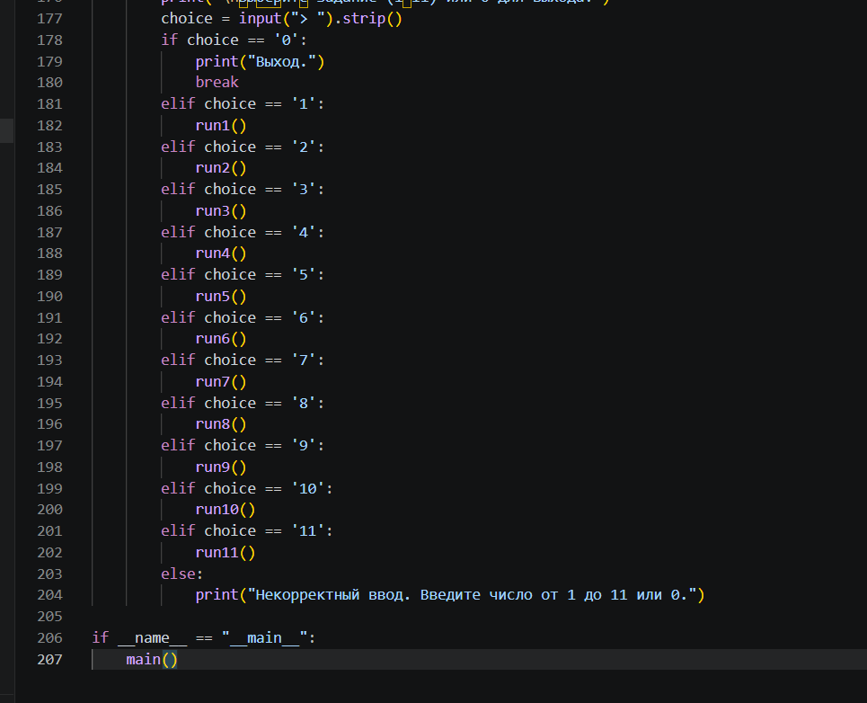
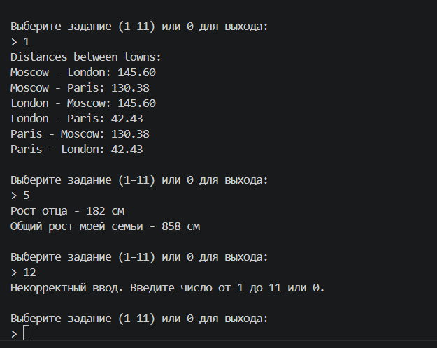

# Лабораторная работа №1 (Medium)

## Вариант 8

## Задание

Разработать верхнеуровневый модуль, который объединяет 11 задач из уровня Rare.  
Каждая задача должна быть инкапсулирована в отдельную функцию.  
Главный модуль позволяет выбрать, какую задачу запустить.

## Обоснование выбора структуры

 Когда я хотела разделить на модули возникла ошибка импорта из-за названий файлов с цифрами и неправильных путей. Когда я объединила все функции в один файл, ошибка пропала. Решила остановиться на таком варианте. программа использует только стандартные возможности Python, без внешних модулей

## Ход работы

### 1. Структура проекта

Вся структура помещена в один файл, который содержит 11 функций с решениями задач уровня rare и функцию, которая выводит меню и вызывает выбранную задачу и блок `if __name__ == "__main__"` для запуска

### 2. Инкапсуляция задач

Для каждого задания из уровня Rare я создала отдельную функцию.  
Внутри функций содержится оригинальный код задания.  

### 3. Запуск

Функция `main()` выводит список заданий, можно ввести нужную цифру и отобразится соответ. функция.
Предусмотрена обработка некорректного ввода и выход из программы по команде `0`.

---------

## Весь код находится в одном файле `lab1M.py`

## Результат

