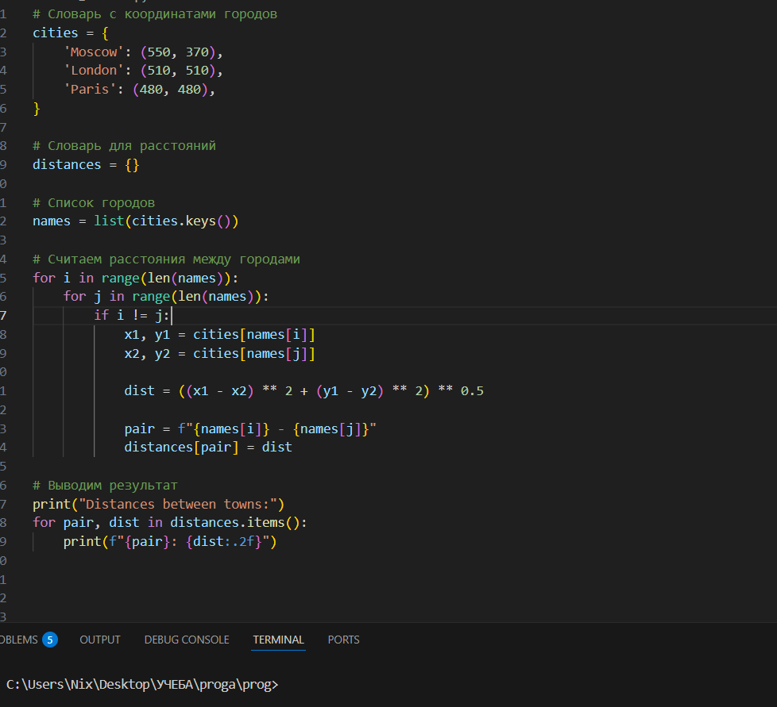
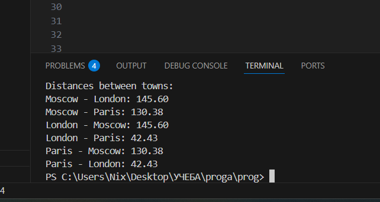

# Отчёт для лабораторной работы №1

## Задание 0

Дан словарь с координатами трёх городов (Moscow, London, Paris).\
Необходимо составить словарь расстояний между каждой парой городов.\
Расстояние вычисляется по формуле евклидова расстояния на координатной сетке: √((x₁ - x₂)² + (y₁ - y₂)²).

## Описание проделанной работы

Сначала создаем словарь с городами, координаты (x, y)\
Для удобства перебора я извлекла названия городов из словаря. Это позволило обращаться к городам по индексам.\
Для перебора я использовала два вложенных цикла.\
По формуле Евклида высчитывалось расстояние.\
Для каждой пары создавался ключ-строка и сохранялось значение.\
В итоге программа выводит все найденные значения.

## Код

## Вывод на консоле

