# Отчёт для лабораторной работы №1

## Задание 0

Дан словарь с координатами трёх городов (Moscow, London, Paris).\
Необходимо составить словарь расстояний между каждой парой городов.\
Расстояние вычисляется по формуле евклидова расстояния на координатной сетке: √((x₁ - x₂)² + (y₁ - y₂)²).

### Описание проделанной работы

Сначала создаем словарь с городами, координаты (x, y)\
Для удобства перебора я извлекла названия городов из словаря. Это позволило обращаться к городам по индексам.\
Для перебора я использовала два вложенных цикла.\
По формуле Евклида высчитывалось расстояние.\
Для каждой пары создавался ключ-строка и сохранялось значение.\
В итоге программа выводит все найденные значения.

### Код

### Вывод на консоле

## Задание 1

Программа должна посчитать площадь круга и определить, попадают ли две указанные точки в этот круг.

### Описание проделанной работы

Берем значение радиуса круга - 42 и число π (я взяля его равным 3.1415926.)\
По формуле площади круга S = π * r² я рассчитала площадь.\
Чтобы получить результат с точностью до 4 знаков после запятой, я использовала функцию round(), которая округлила полученное значение.

Для проверки первой точки с координатами (23, 34) я извлека отдельно координаты x и y из кортежа point_1.\
Для пределения центра в начале координат, я использовала теорему Пифагора (x² + y²). Если расстояние меньше или равно радиусу, значит точка внутри круга. Результат сравнения (True или False) сохранила в переменную и вывела на экран.

### Код

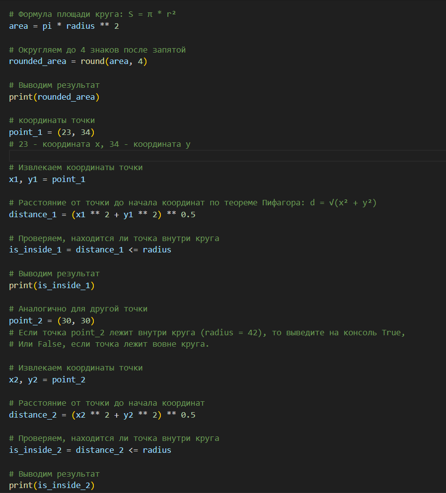

### Вывод на консоле

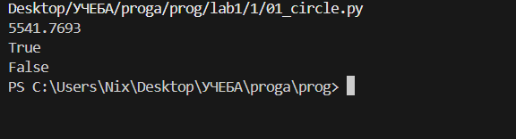

## Задание 2

Нужно найти правильную комбинацию сложений, вычитаний, умножений и скобок между цифрами 1 2 3 4 5, чтобы ответ был равен 25.

### Описание проделанной работы

Я начала подбирать комбинации, пробуя разные варианты группировки чисел.\
Один из вариантов: 1 * 2 + 3 = 6, затем умножить полученную сумму на 4: 5 * 4 = 20, и прибавить последнее число 5: 20 + 5 = 25.\
В итоге получилась формула (1 * 2 + 3) * 4 + 5.\
Я записала выражение в переменную formula и вывела его значение на консоль с помощью функции print().

### Код

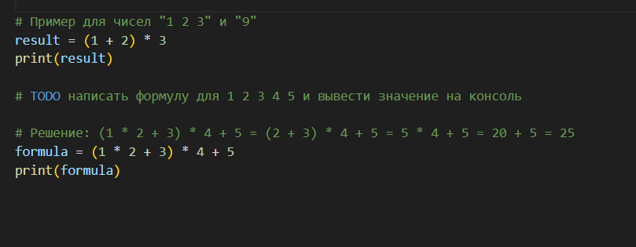

### Вывод на консоле

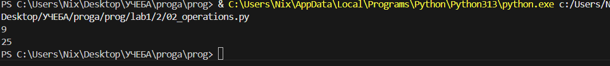

## Задание 3

Вывести на консоль четыре фильма: первый, последний, второй и второй с конца.\
При этом запятые и пробелы не должны выводиться, а использовать методы строки (типа .split() или .find()) нельзя.

### Описание проделанной работы

Определяем границы каждого названия фильма путем подсчёта позиций символов в строке my_favorite_movies.\
В этом заданиии использую срезы.\
Для первого фильма срез от начала до 10 символа.\
Для второго срез от -15 символа до конца строки.\
Для третьего фильма начало с 12-го символа, конец на 25-м символе.\
Для последнего срез от 27 до 33 символа.\
В результате каждый срез должен выводить название фильма без запятых и пробелов.

### Код

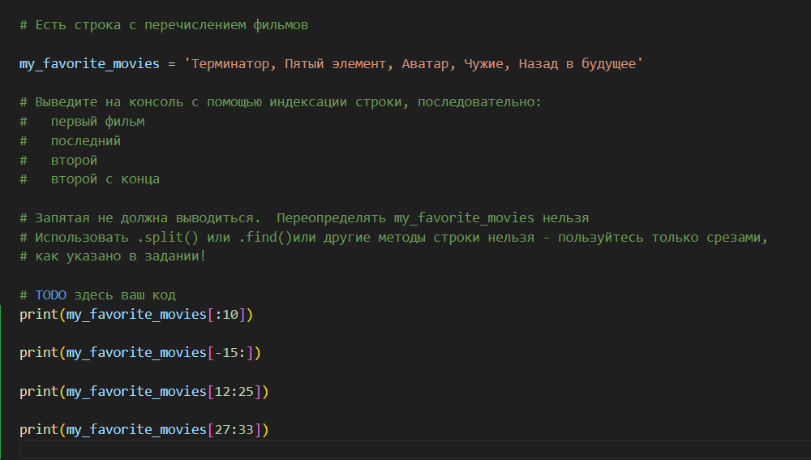

### Вывод на консоле

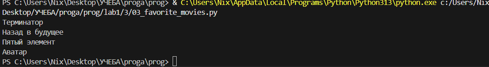

## Задание 4

Нужно создать два списка: my_family (содержит имена членов семьи (минимум 3 элемента)) и my_family_height (состоит из имени и роста члена семьи). Затем нужно вывести на консоль рост отца (используя индексацию) и общий рост всех членов семьи (сумму всех ростов).

### Описание проделанной работы

Создаю список с именами членов семьи.\
Создаю список с именами и соответствующим ростом.\
Для вывода роста отца я использовала индексацию: my_family_height[1][1].\
Первый индекс [1] обращается ко второму элементу списка (папа, так как индексация начинается с 0), а второй индекс [1] обращается к росту (второй элемент во вложенном списке).\
Для подсчета общего роста семьи я сложила значения ростов всех членов семьи, обращаясь к каждому из них по индексам: [0][1] (мама), [1][1] (папа), [2][1] (брат), [3][1] (дедушка), [4][1] (бабушка).\
Полученную сумму сохранила в переменную total_height и вывела на консоль с помощью f-строки в требуемом формате.

### Код

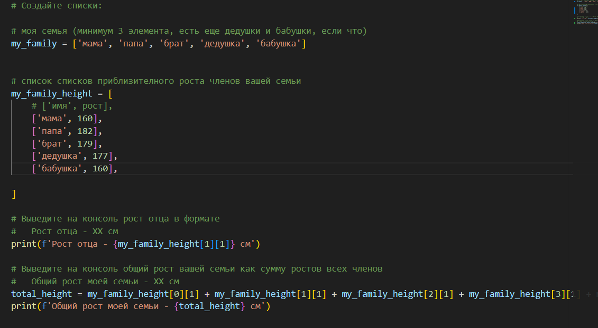

### Вывод на консоле

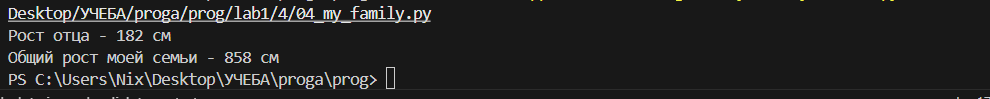

## Задание 5

Нужно выполнить несколько операций со списком животных в зоопарке: добавить медведя между львом и кенгуру, добавить птиц в конец списка, удалить слона, а затем вывести номера клеток (позиции в списке) для льва и жаворонка, используя понятную для обычного человека нумерацию (с 1, а не с 0).

### Описание проделанной работы

### Код

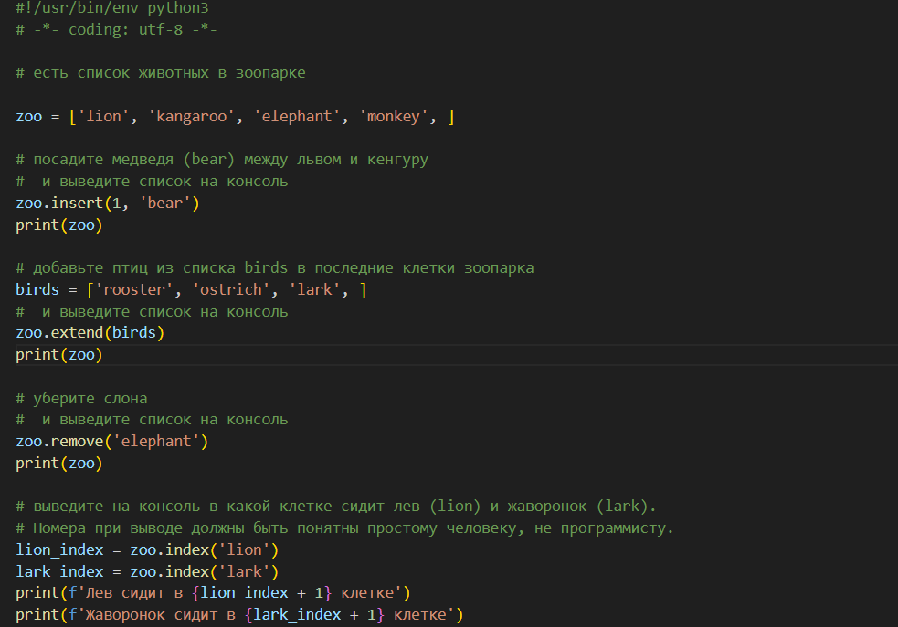

### Вывод на консоле

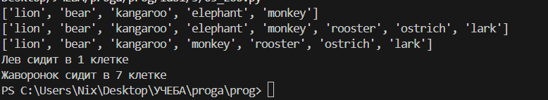

## Задание 6

Нужно вычислить общее время звучания двух наборов песен (по три песни в каждом)\
первый набор из списка списков, второй набор из словаря.\
Результат нужно вывести с точностью до двух знаков после запятой в заданном формате.

### Описание проделанной работы

Сначала я работала со списком violator_songs_list.\
Чтобы получить время звучания нужных песен, я использовал индексацию. Песня 'Halo' находится на 4-й позиции (индекс 3), время звучания хранится во втором элементе вложенного списка под индексом 1, поэтому я записал violator_songs_list[3][1]. Для 'Enjoy the Silence' (индекс 5) и 'Clean' (индекс 8). Затем я сложила полученные значения и сохранила сумму в переменную total_time_1. Для округления до двух знаков после запятой я использовала функцию round(total_time_1, 2). Результат вывела с помощью f-строки в требуемом формате.\

Затем я перешела к словарю violator_songs_dict. Я обратилась к элементам словаря, указав названия песен в квадратных скобках: violator_songs_dict['Sweetest Perfection'], violator_songs_dict['Policy of Truth'] и violator_songs_dict['Blue Dress']. Полученные значения сложила в переменную total_time_2, округлила с помощью round() до двух знаков и вывела на консоль.

### Код

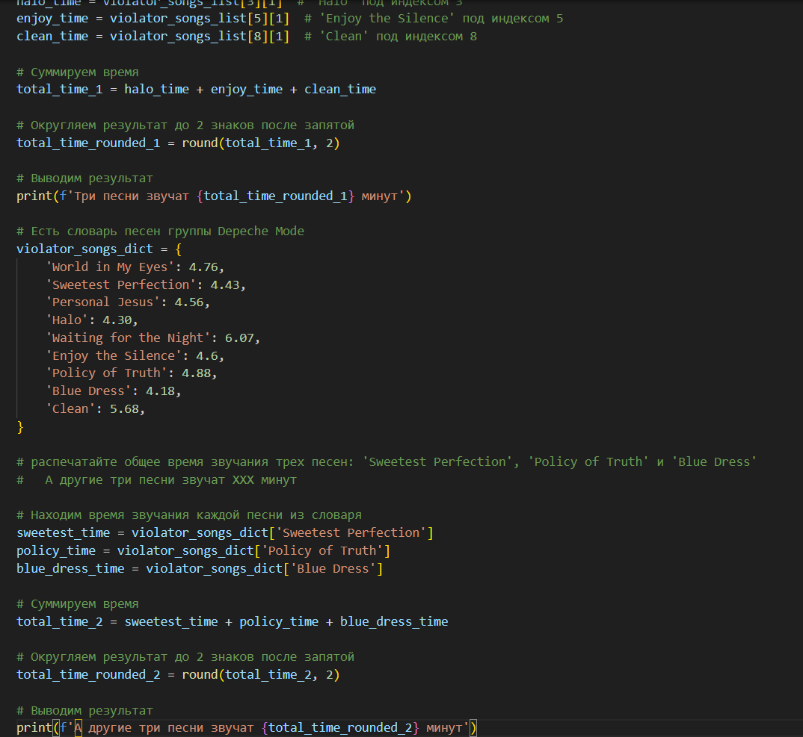

### Вывод на консоле

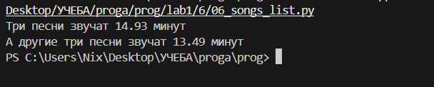

## Задание 7

Нужно расшифровать секретное сообщение, которое состоит из пяти зашифрованных слов, каждое хранится в отдельном элементе списка. Для каждого слова задан свой алгоритм расшифровки: нужно извлечь определенные буквы по номерам позиций (нумерация с 1, а не с 0) с помощью срезов строк, включая извлечение через одну букву и в обратном порядке.

### Описание проделанной работы

Для первого слова мне нужно было взять 4-ю букву из первого элемента списка. Я использовала обращение secret_message[0][3].\
Для второго слова требовались буквы с 10 по 13 включительно из второго элемента, я указала secret_message[1][9:13].\
Для третьего слова я использовала срез с шагом 2: secret_message[2][5:15:2]. Получилось: 5 - индекс 6-й буквы, 15 - индекс, следующий за 15-й буквой, а шаг 2 означает, что берутся буквы через одну.\
Для четвертого слова требовались буквы с 8 по 13 в обратном порядке. Я применила обратный срез secret_message[3][12:6:-1].\
Для пятого слова нужно было взять буквы с 17 по 21 в обратном порядке. Я использовала срез secret_message[4][20:15:-1] (шаг -1 для обратного порядка).

После того как все слова были извлечены, я соединила их в одну строку через пробел и вывела на консоль. 

### Код

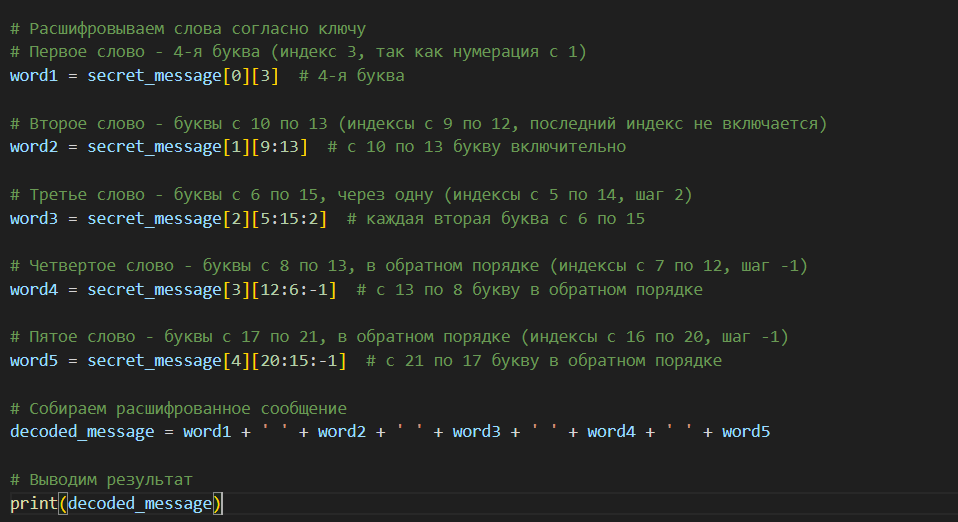

### Вывод на консоле

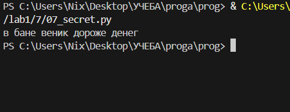

## Задание 8

Нужно избавиться от дубликатов, а затем выполнить операции над множествами: найти объединение (все виды цветов), пересечение (цветы, растущие в обоих местах), разность (цвета, растущие только в саду и только на лугу).

### Описание проделанной работы

Сначала я создала множества garden и meadow, используя функцию set().\
В кортежах были повторяющиеся цветы (например, 'ромашка' и 'роза' встречались несколько раз), а множество автоматически убирает дубликаты, оставляя только уникальные элементы. Так я получила garden_set и meadow_set.\
Для вывода всех видов цветов я использовала операцию объединения множеств | Эта операция собирает все уникальные цветы из обоих множеств в одно.\
Я применила операцию пересечения & (intersection()).\
Для цветов, растущих только в саду, я использовала операцию разности - ( ifference()), garden_set - meadow_set возвращает элементы, которые есть в саду, но отсутствуют на лугу.\
Все результаты я вывела на консоль с помощью f-строк, добавив поясняющий текст, чтобы вывод был понятным.

### Код

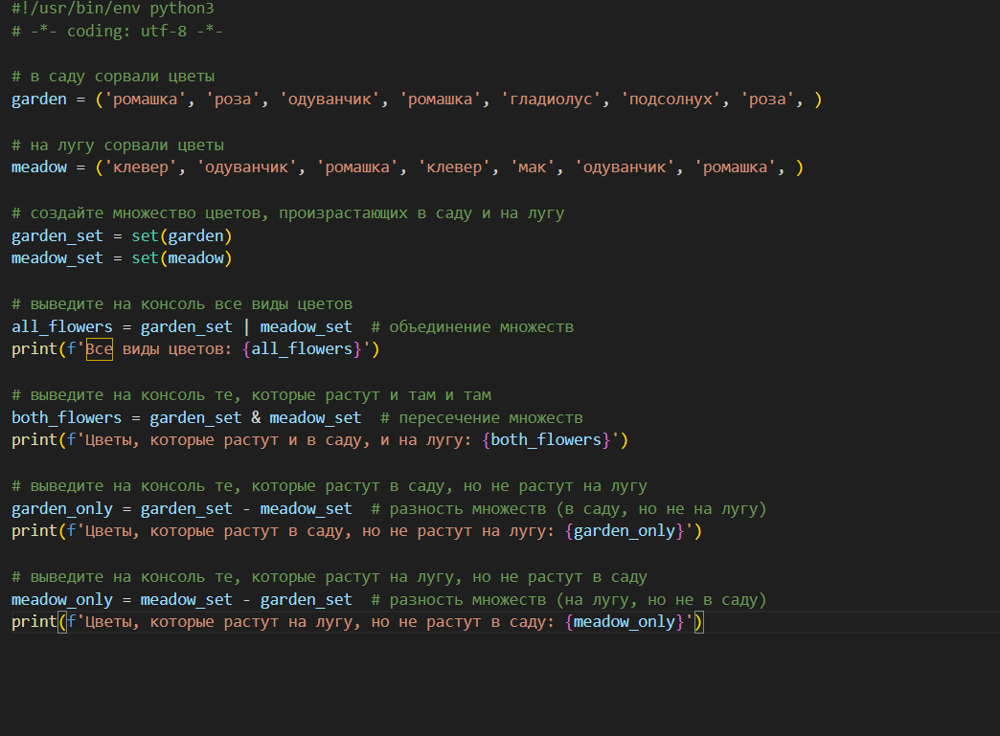

### Вывод на консоле

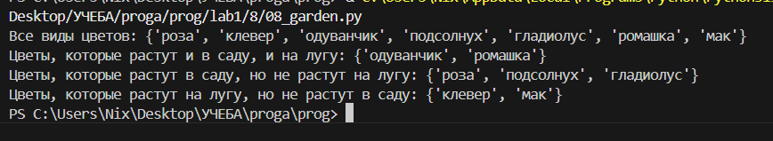

## Задание 9

Нужно создать новый словарь sweets на основе исходного словаря shops, в котором ключами будут названия сладостей, а значениями — список из двух магазинов с самыми низкими ценами на эту сладость. Для каждой сладости нужно выбрать два магазина с минимальными ценами.

### Описание проделанной работы

После того как я собрала все данные, я сформировала словарь sweets, где для каждого продукта указала список из двух словарей. Каждый внутренний словарь содержит название магазина и цену. Я расположила магазины в порядке возрастания цены для наглядности.\
В конце я добавила цикл для вывода результата, чтобы проверить правильность заполнения словаря. Вывод показывает каждую сладость и два магазина с самыми выгодными ценами.

### Код

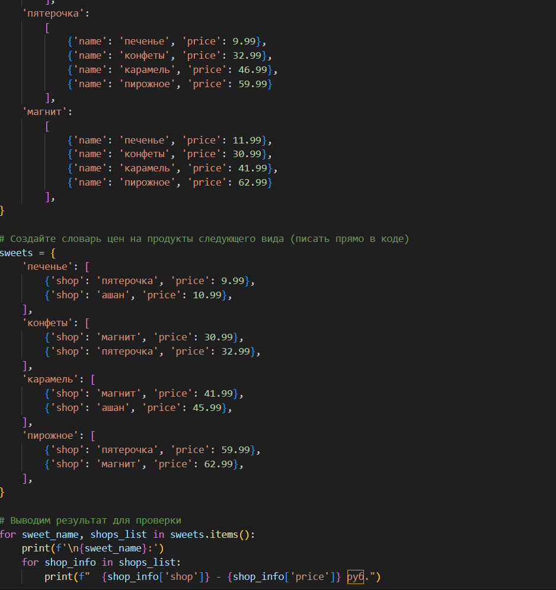

### Вывод на консоле

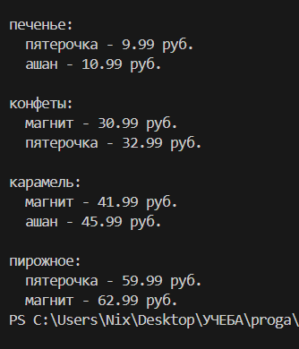

## Задание 10

Нужно на основе исходного словаря shops создать новый словарь sweets, в котором ключами будут названия сладостей, а значениями — список из двух магазинов с самыми низкими ценами на эту сладость. Для каждой сладости нужно выбрать два магазина с минимальными ценами.

### Описание проделанной работы

Сначала я проанализировала исходный словарь shops, в котором для каждого магазина указаны цены на четыре вида сладостей. Для каждой сладости (печенье, конфеты, карамель, пирожное) я сравнила цены во всех трех магазинах. Затем я отобрала по два магазина с самыми низкими ценами для каждой сладости. После этого я создала новый словарь sweets, где ключом является название сладости, а значением — список из двух словарей, каждый из которых содержит название магазина и его цену. В конце я добавила цикл для вывода результата в удобочитаемом виде.

### Код

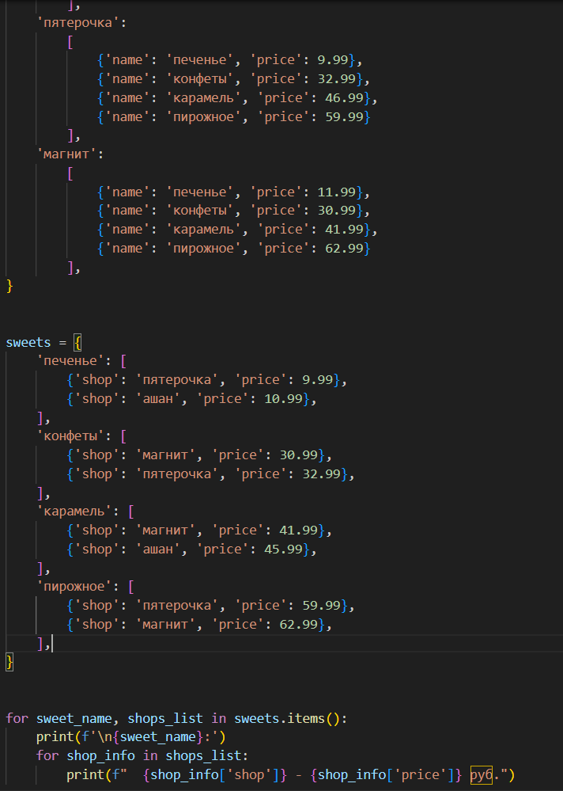

### Вывод на консоле

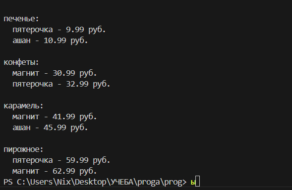
