# **Отчет по лабораторной работе №2**

## Задание

Построить график функции (вариант 2) и касательную к ней. Добавить на график заголовок, подписи осей, легенду, сетку, аннотацию к точке касания. Выполнить 1-3 уроки из книги Matplotlib

## Описание проделанной работы

### 1. Создание виртуального окружения

Я использовала команду `python -m venv env`. Потом активировала через `env\Scripts\activate` (я работаю на Windows). Затем установила библиотеки `numpy` и `matplotlib`, потому что они нужны для математических вычислений и построения графиков.

### 2. Выполнение уроков 1–3 из книги

В уроках 1–3 рассказывалось как нарисовать линию (plt.plot), добавить заголовок (plt.title), подписать оси (plt.xlabel и plt.ylabel), включить сетку (plt.grid), показать легенду (plt.legend), вывести график на экран (plt.show), разместить графики в разные окна.

### Урок 1:
**1.1**

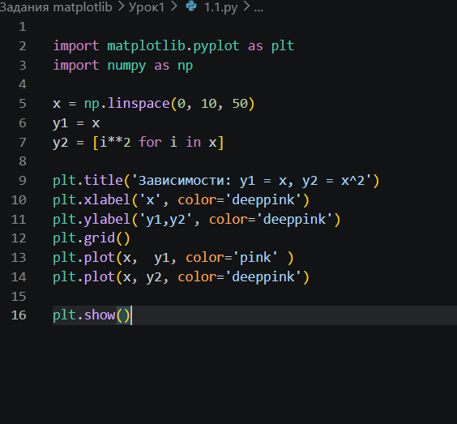
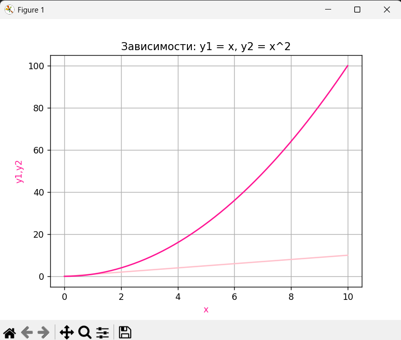

**1.2**

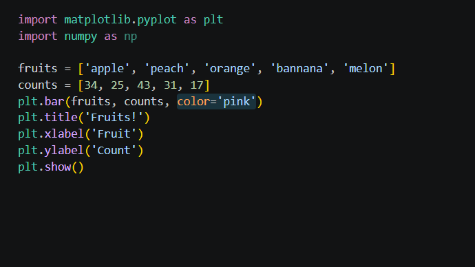
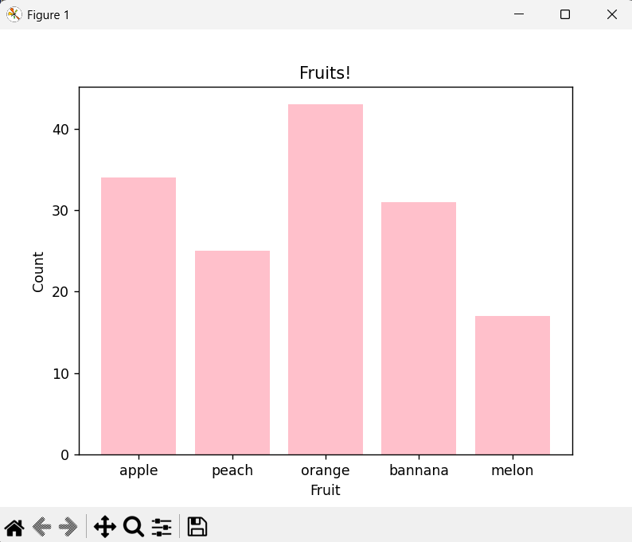

### Урок 2:

**2.1**
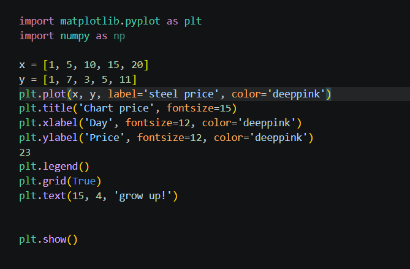
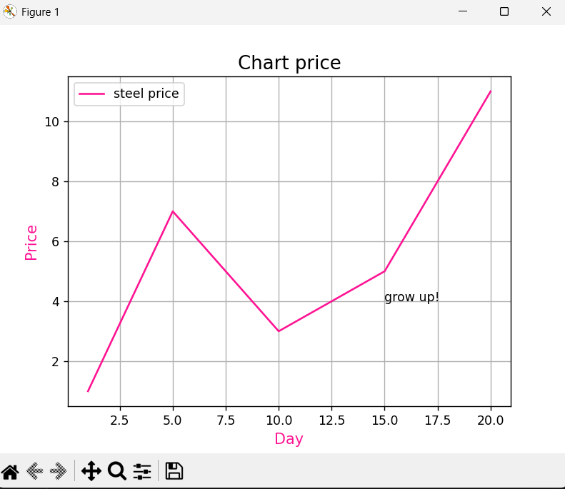

**2.2**
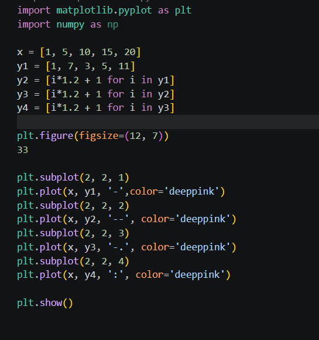
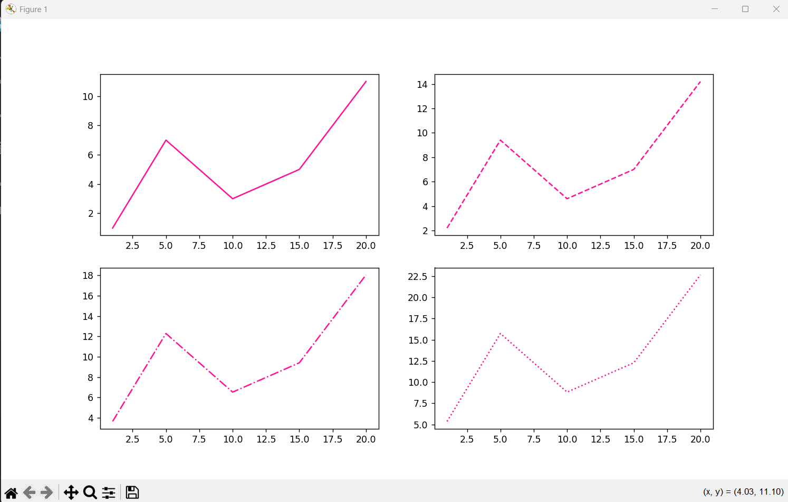

### Урок 3:

**3.1**
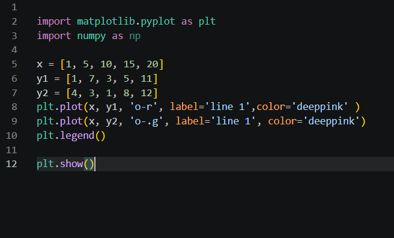
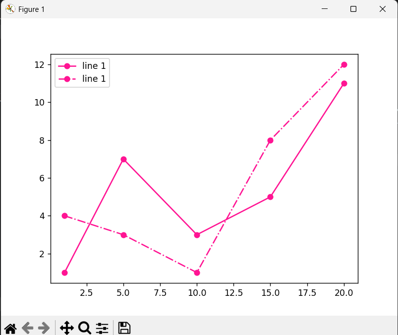

**3.2**
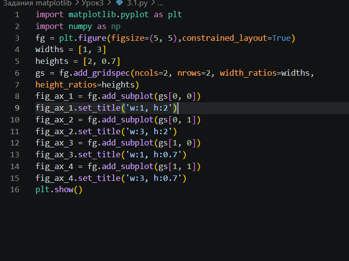
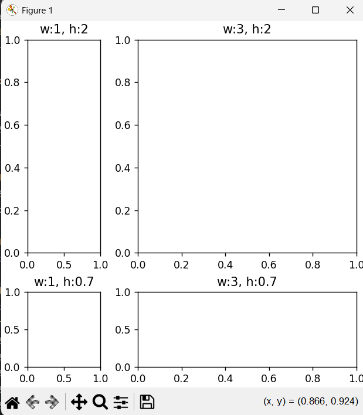

### 3. Построение графика моей функции

Для построения графика нужно передать массив `x`, для касательной нужно посчитать значение в одной точке.

Функция работает так:
- если `x <= 0.25` , то формула `e^(sin x)`
- если `x > 0.25` , то формула `e^x - 1/√x`

### 4. Построение касательной

Я выбрала точку `x₀ = 0.3` для касательной, потому что она лежит во второй части функции и не слишком близко к границе.

Чтобы найти наклон касательной (производную), я использовала численный метод:
`f'(x) ≈ (f(x + 0.000001) - f(x)) / 0.000001`
Это маленькое число (eps) я взяла `1e-6`. Так можно приближённо найти производную.

Затем я составила уравнение касательной: `y = f(x₀) + f'(x₀) * (x - x₀)`

### 5. Оформление графика

Я добавила на график заголовок, подписи осей, сетку, легенду и аннотацию.

### Код

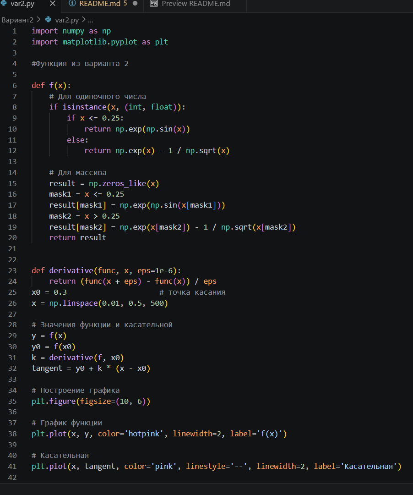
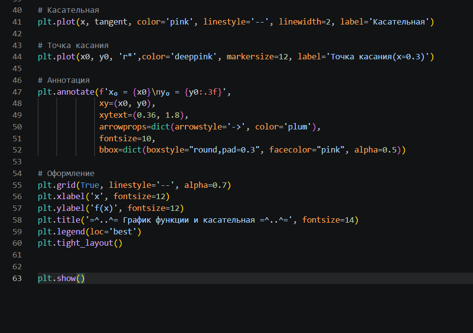

### Результат кода

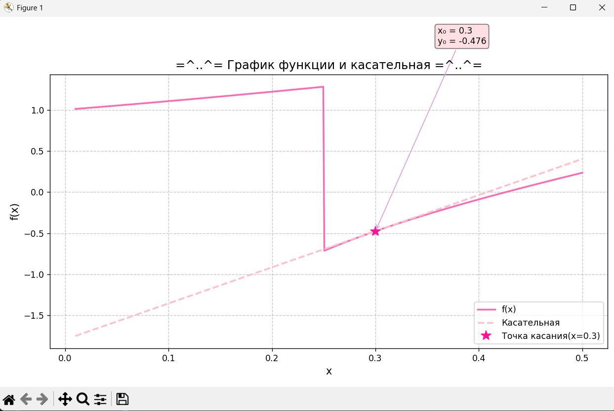
