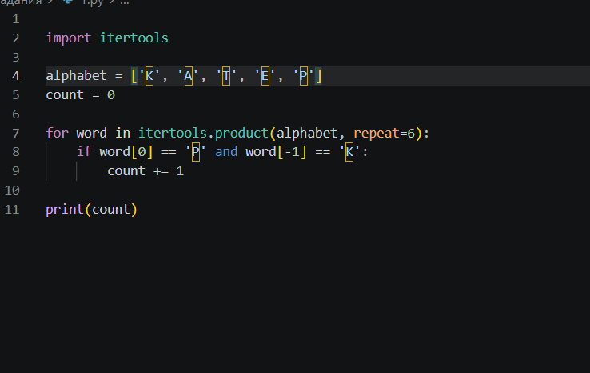
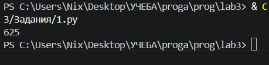
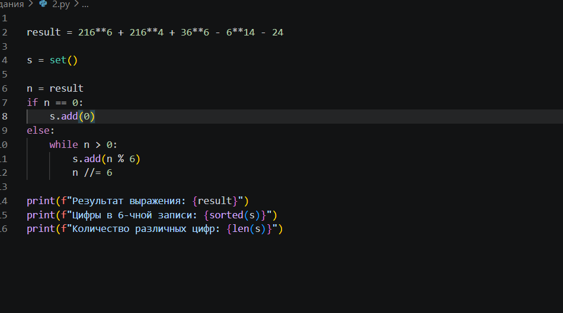
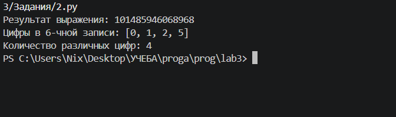
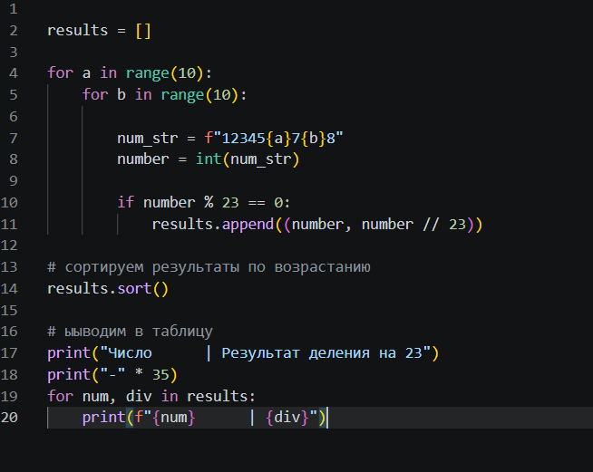
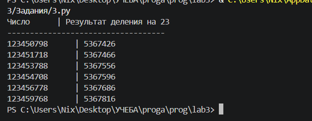

# **Лабораторная работа №3. Отчёт**

## Вариант 8

## Задание 1

Рассматриваются символьные последовательности длины 6 в пятибуквенном алфавите {К, А, Т, Е, Р}. Сколько существует таких последовательностей, которые начинаются с буквы Р и заканчиваются буквой К?

### Описание проделанной работы 

Я использовала библиотеку `itertools`, потому что в задании сказано использовать её для решения. С помощью `itertools.product` я перебрала все возможные последовательности длины 6 из букв алфавита.
Если первая буква равна 'Р' и последняя буква равна 'К', то увеличиваю счётчик на 1. 
В конце программа выводит количество подходящих последовательностей.

**Код**

**Вывод на консоль**

## Задание 2

Данное выражение записать в системе счисления с основанием 6. Посчитать, сколько различных цифр в нём.

### Описание проделанной работы 

Сначала я вычислила значение выражения. Получилось очень большое число. Затем я перевела это число в нужную систему счисления. Для этого я в цикле делила число на 6 и записывала остатки от деления во множество. Множество автоматически убирает повторяющиеся цифры, поэтому в конце я просто посчитала количество элементов в множестве.

**Код**

**Вывод на консоль**

## Задание 3

Среди натуральных чисел, не превышающих 10**9, найдите все числа, соответствующие маске 12345?7?8, делящиеся на число 23 без остатка. Для каждого найденного числа выведите его и результат деления на 23.

### Описание проделанной работы 

Я перебрала все возможные значения для двух неизвестных цифр (от 0 до 9), составила число и проверила, делится ли оно на 23 без остатка. Если делится — вывела число и результат деления.

**Код**

**Вывод на консоль**

