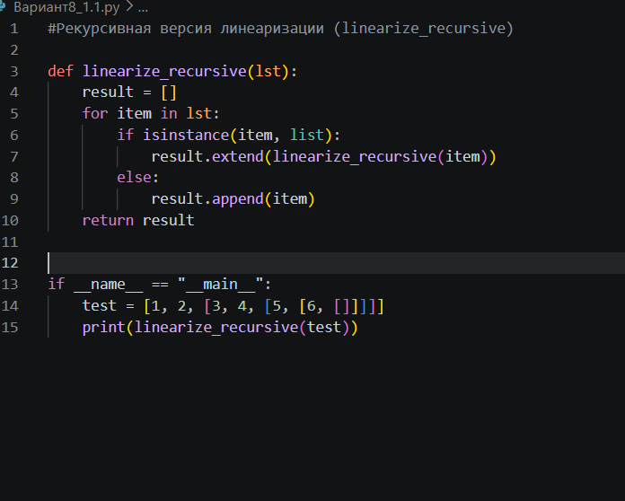
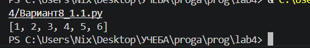
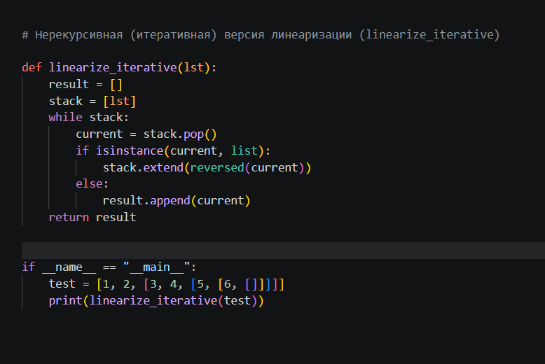
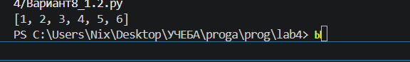
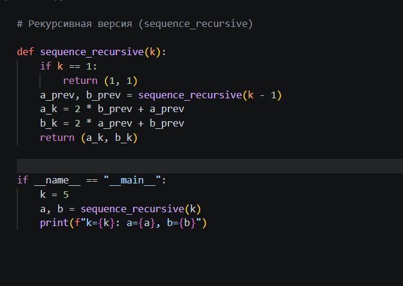
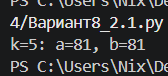
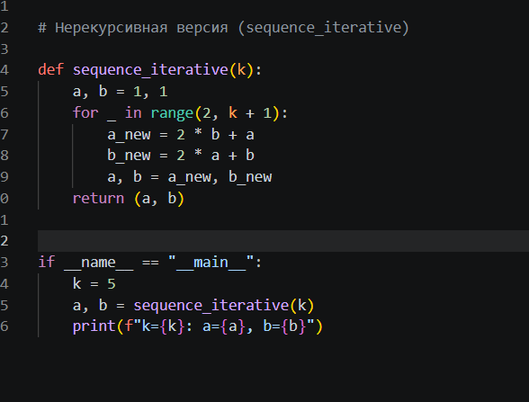
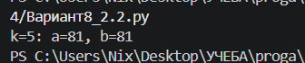

# Лабораторная работа №4

## Вариант 8

## Задание 1.1. Линеаризация списка (рекурсивная версия)

### Условие

Написать функцию, которая превращает вложенный список (список списков любой глубины) в плоский список, содержащий все элементы в порядке обхода.

### Ход работы

Я написала функцию `linearize_recursive`, которая обходит переданный ей список элемент за элементом. Если элемент - это не список,а число, я просто добавляю его в результат. Если элемент - это список, я вызываю эту же функцию снова (рекурсия), чтобы разобрать уже его. Так продолжается, пока не останутся только обычные элементы.

### Код

### Результат

## Задание 1.2. Линеаризация списка (итеративная версия)

### Условие

То же самое, что в задании 1.1, но без использования рекурсии.

### Ход работы

Я написала функцию linearize_iterative, которая использует обычный список вместо рекурсии. Я кладу исходный список в стек. Пока стек не пуст, я достаю из него последний элемент и проверяю. Если он список, то я кладу обратно в стек все его элементы (переворачивая порядок, чтобы сохранить исходную последовательность). Если он не список, то я добавляю его в результат.

### Код

### Результат

## Задание 2.1. Рекуррентная последовательность (рекурсивная версия)

### Условие

даны формулы a_k=2*b_k-1 + a_k-1 и b_k = 2*a_k-1 + b_k-1, a1=1 и b1=1. Написать функцию, которая вычисляет a, b для k.

### Ход работы

Я написала рекурсивную функцию sequence_recursive(k). Если k=1, она возвращает (1, 1). В противном случае она сначала вызывает саму себя для k-1, получает предыдущие a и b, а затем по формулам вычисляет текущие. Рекурсия здесь подходит, потому что каждое следующее значение зависит от предыдущего. 

### Код

### Результат

## 2.2. Рекуррентная последовательность (итеративная версия)

### Условие

То же самое, что в задании 2.1, но без использования рекурсии.

### Ход работы

Я написала функцию sequence_iterative(k), которая использует обычный цикл for. Я завела переменные a и b, равные 1 (это для
k=1). Затем в цикле от 2 до k я пересчитываю их по формулам, запоминая новые значения во временные переменные, а потом обновляю a и b. Для больших k лучше использовать цикл, который работает быстрее и не переполняет стек.

### Код

### Результат

