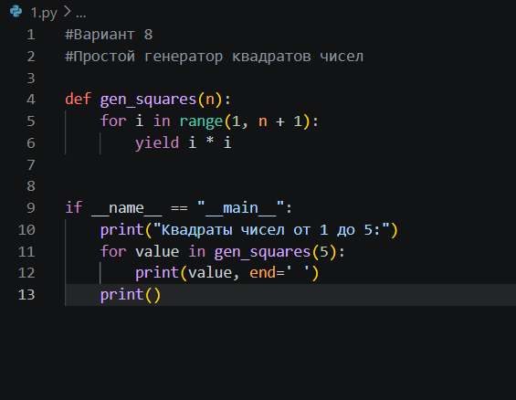
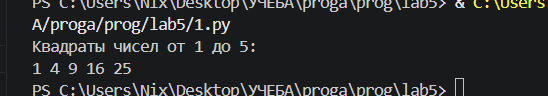
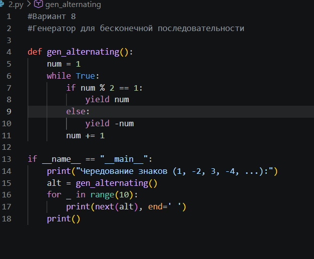
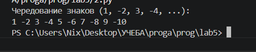
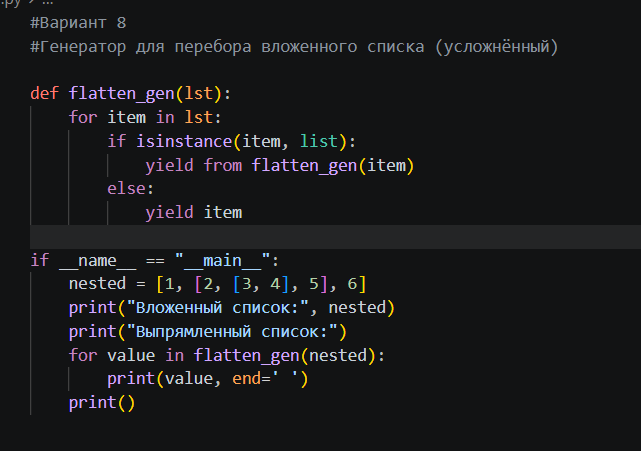
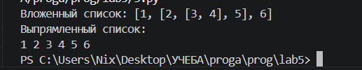
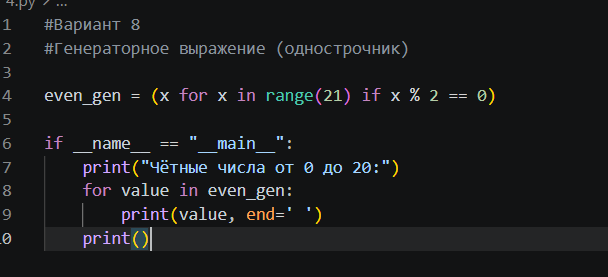
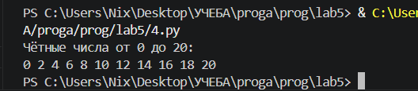

# Лабораторная работа №5

## Вариант 8

## Задание 1. Генератор квадратов чисел

### Условие

Написать генератор, который принимает число `n` и возвращает квадраты чисел от 1 до `n` по одному.

### Ход работы

Я написала функцию `gen_squares(n)`, в которой использовала цикл `for` от 1 до `n`. На каждой итерации я возвращаю квадрат текущего числа с помощью `yield`. 
В конце я добавила блок `if __name__ == "__main__":`, чтобы код запустить. я создала генератор для `n = 5` и в цикле `for` вывела все значения.

### Код

### Результат

## Задание 2. Генератор для бесконечной последовательности

### Условие

Создать бесконечный генератор, который возвращает последовательность: 1, -2, 3, -4, 5, -6, … (знак чередуется)

### Ход работы

Я написала функцию `gen_alternating()`, в которой использовала бесконечный цикл `while True`. Переменная `num` увеличивается от 1 до бесконечности. Проверяю: нечет. число - возвращаю его как есть (`yield num`), если чётное, то  возвращаю со знаком минус (`yield -num`)
В коде я вывела только первые 10 значений, чтобы программа не работала бесконечно.

### Код

### Результат

## Задание 3. Генератор для перебора вложенного списка (усложнённый)

### Условие

На вход даётся список, внутри которого могут быть другие списки (любая глубина вложенности). Генератор должен выдавать все элементы по одному.

### Ход работы

Я написала рекурсивную функцию-генератор `flatten_gen(lst)`. Она проходит по каждому элементу списка. Если элементчисло, функция возвращает его через `yield`. Если элемент - это список, функция вызывает саму себя для этого вложенного списка с помощью `yield from`. 

### Код

### Результат

## Задание 4. Генераторное выражение (чётные числа)

### Условие

С помощью генераторного выражения создать объект, который возвращает только чётные числа из диапазона от 0 до 20.

### Ход работы

Я использовала создание генератора в одну строчку. Я написала (x for x in range(21) if x % 2 == 0), перебираю числа от 0 до 20 и беру только чётные. Получившийся генератор я сохранила в переменную even_gen. Потом в цикле for я вывела все его значения. генератор не хранит все числа в памяти, а выдаёт их по одному.

### Код

### Результат

