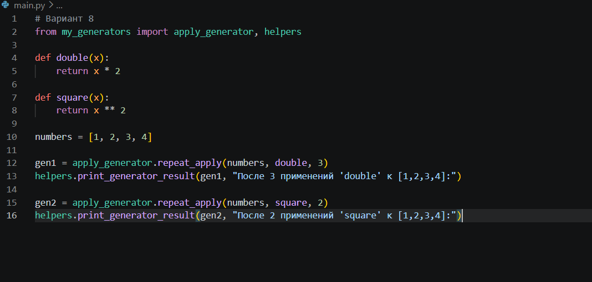
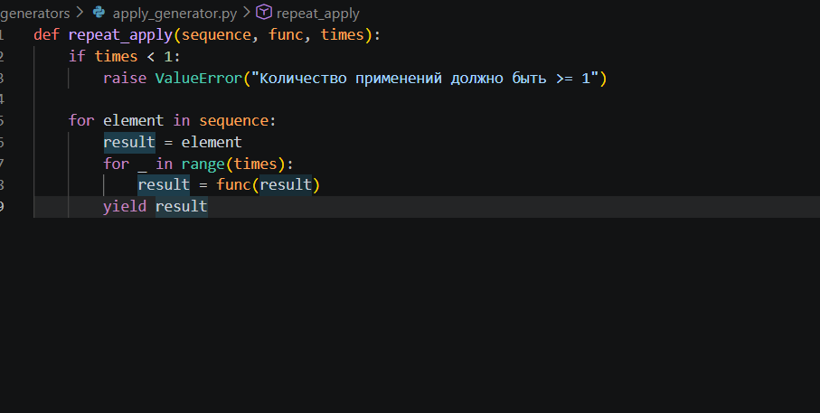
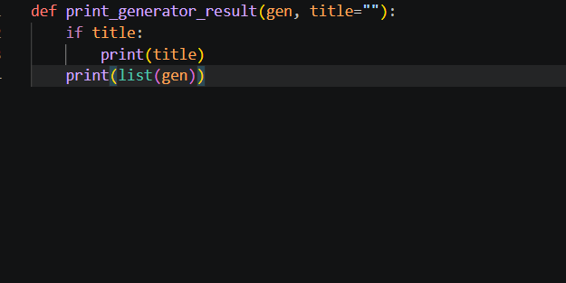
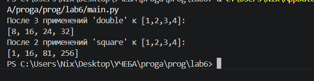

# Лабораторная работа №6

## Вариант 8

## Условие

Создать пакет, содержащий 3 модуля, и подключить его к основной программе.
Создать ненератор, применяющий заданную функцию к каждому элементу последовательности N раз.

## Ход работы

### 1. Создание структуры пакета

Я создала папку `my_generators` (пакет). 
Внутри неё я создала 4 файла:
`__init__.py`  делает папку пакетом
`apply_generator.py`  модуль с генератором
`example_functions.py` модуль с примерами функций 
`helpers.py` вспомогательный модуль 
В основной программе `main.py` я импортировала нужные функции из пакета и показала работу генератора.

### 2. Содержимое модулей

#### Модуль `apply_generator.py`

В этом файле я написала функцию-генератор `repeat_apply`. 
Она принимает список, функцию и количество применений. Для каждого элемента она применяет функцию n раз и возвращает результат через `yield`. 

#### Модуль `example_functions.py`

функции для демонстрации:
`double`  удваивает число
`square` возводит число в квадрат

#### Модуль `helpers.py`

Функция `print_generator_result` принимает заголовок и сам генератор, превращает его в список и печатает.

#### Код `main.py`

#### Код `apply_generator.py`

#### Код `helpers.py`

#### Результат выполнения

