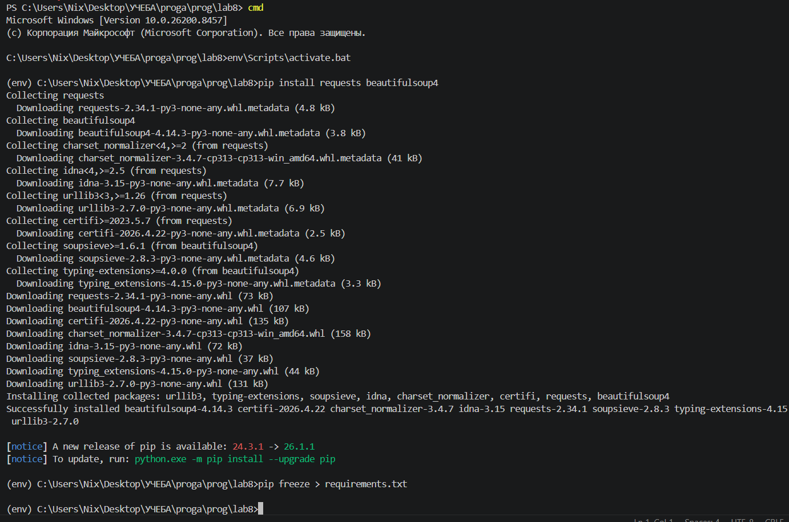
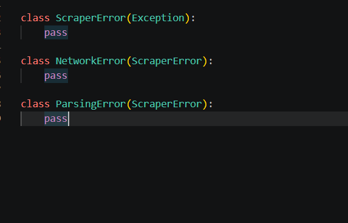
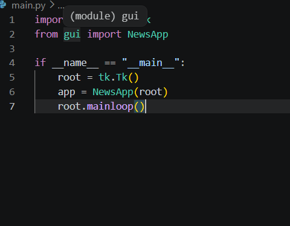
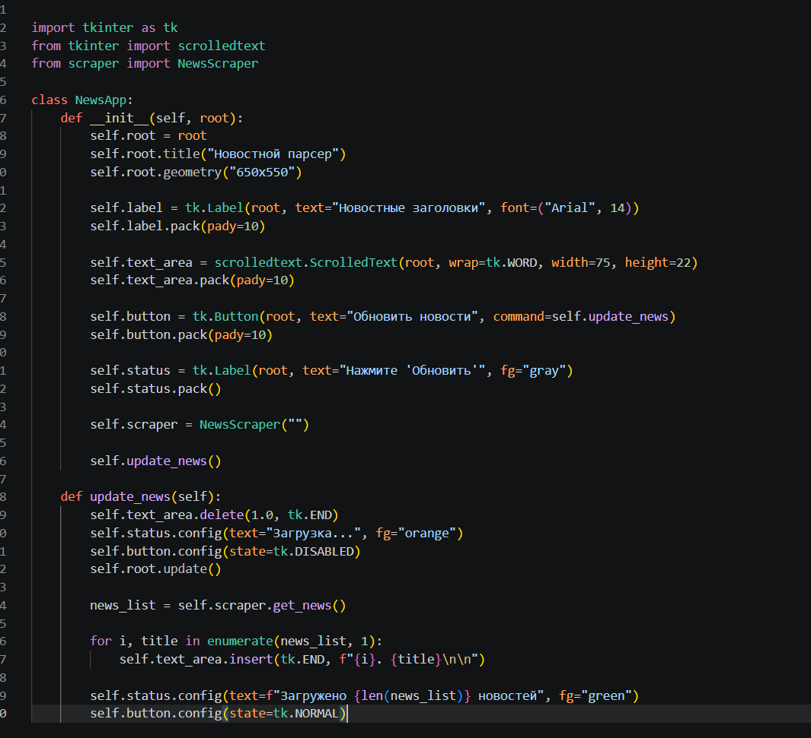
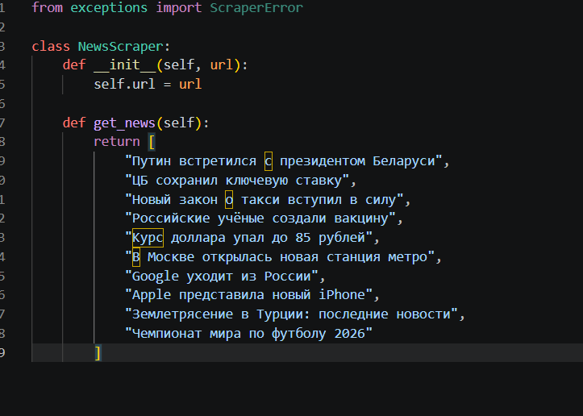
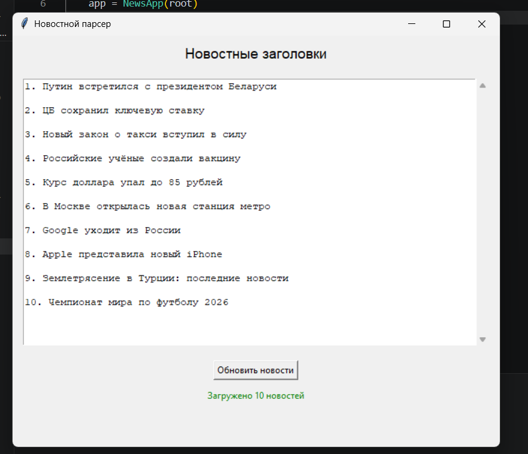

# Лабораторная работа №8

## Вариант 8: Веб-скрейпинг новостных заголовков

## Название приложения
Новостной парсер

## Описание

Это приложение с граф. интерфейсом, которое показывает список новостных заголовков. 
Изначально я планировала, что программа будет сама заходить на сайт новостей и вытаскивать оттуда заголовки. Но сайты, которые я пробовала (например, lenta.ru, rbc.ru), блокируют такие запросы, потому что думают, что это не человек, а робот. Поэтому для демонстрации интерфейса я использовала готовый список новостей, который хранится прямо в коде. Кнопка "Обновить новости" работает, список меняется (если в коде добавить новые тестовые данные). 

## Ход работы

**exceptions.py** файл. В нём три класса ошибок:

ScraperError - главная ошибка парсера\
NetworkError - ошибка подключения к интернету\
ParsingError - ошибка при разборе HTML-кода\

Файл **scraper.py** парсер новостей\
В этом файле я написала класс NewsScraper.\
Сначала я пыталась через библиотеки requests и BeautifulSoup скачивать страницы новостных сайтов и вытаскивать оттуда заголовки. Но сайты блокировали мои запросы, поэтому я сделала тестовый список новостей прямо в коде.
(для демонстрации работы)

Файл **gui.py** графический интерфейс\
Здесь я создала класс NewsApp. \
Внутри него:\
__init__ создаёт надпись, текстовое поле (со скроллом), кнопку, строку состояния.

update_news вызывается при нажатии на кнопку. Она очищает поле, загружает свежий список новостей из парсера и выводит их на экран.\
Текстовое поле я сделала с прокруткой (scrolledtext), чтобы помещалось много новостей.\

Файл **main.py**\
Он импортирует класс NewsApp из gui.py, создаёт окно tkinter и запускает приложение.

Сначала я использовала реальный парсинг, но сайт блокировал запросы, поэтому я сделала тестовые данные для демонстрации интерфейса.

### установка окружения

## Коды

### exceptions.py

### main.py

### gui.py

### scraper.py

### результат

